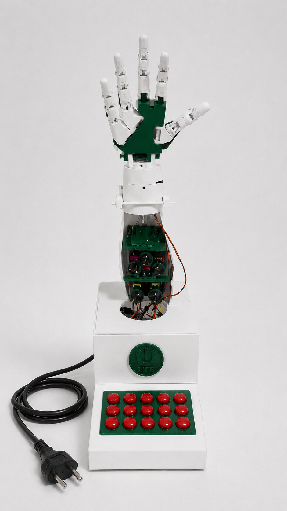
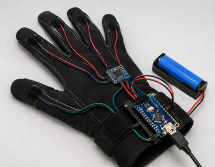
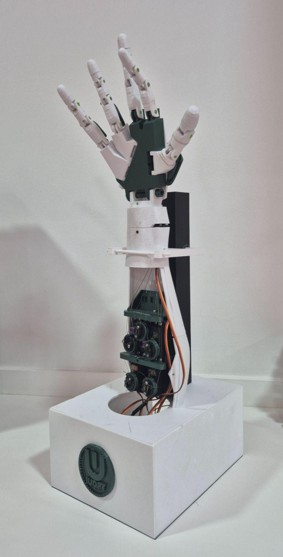

# CREATIBIO - Interfaces Humano-Máquina y Bioingeniería Aplicada

Repositorio correspondiente a la línea de Interfaces Humano-Máquina y Bioingeniería Aplicada de CREATIBIO.

Esta línea se enfoca en el diseño y desarrollo de dispositivos interactivos capaces de captar, interpretar y responder a señales humanas mediante electrónica, sensores, programación, impresión 3D y sistemas de control.

## Proyectos

### Mano robótica impresa en 3D

Diseño, impresión y ensamblado de una mano robótica funcional como plataforma educativa de bioingeniería, robótica e interfaces de control.

### Guante con acelerómetro

Desarrollo de un guante sensado para captura de movimiento, reconocimiento gestual y control de dispositivos.

### Sistemas de control gestual

Exploración de interfaces basadas en señales, movimiento y reconocimiento de patrones.

## Contenido del repositorio

- Diseños CAD
- Electrónica y firmware
- Documentación técnica
- Registros de prototipos
- Material de apoyo
- Imágenes y prototipos proyectados

## Capacidades involucradas

- Bioingeniería
- Robótica
- Impresión 3D
- Sensores
- Arduino y sistemas embebidos
- Procesamiento de señales
- Control gestual
- Programación

## Prototipo proyectado

## Estado de avance

## Organización

Responsable de línea:
- Mariana Menéndez

CREATIBIO – IUDPT
